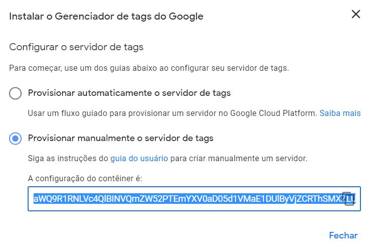
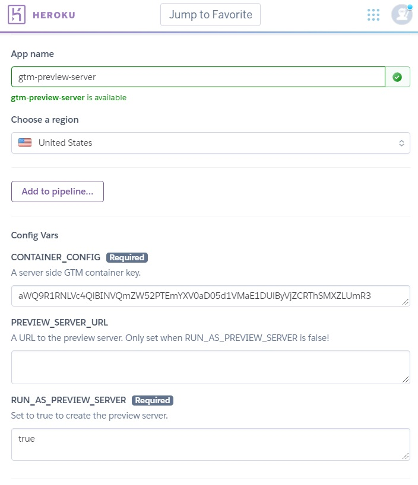
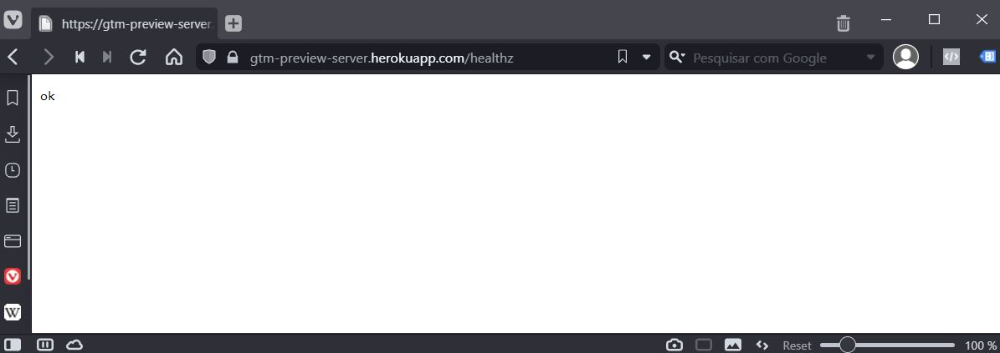
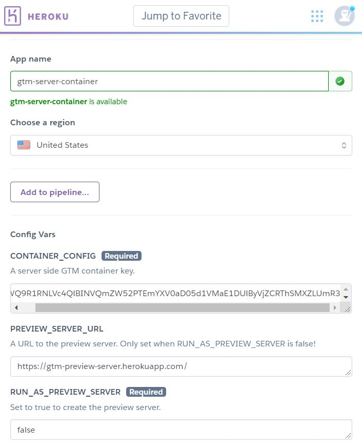

# Google Tag Manager Server Side Container deployable to Heroku

It is now possible to create a Google Tag Manager Server Side Container. The automatic deploy creates a robust Google Cloud Platform infrastructure that is scalable and fault-toleraent but is not cost-effective for small businesses and low-to-medium traffic sites. Using Google Cloud to host it is very expensive, approximately $120 USD/month. 

Fortunately Google provided instructions for [manual setup of the server side container](https://developers.google.com/tag-manager/serverside/manual-setup-guide) and a docker image: `gcr.io/cloud-tagging-10302018/gtm-cloud-image:stable`. 

I created this repository to help creating GTM server side containers using Heroku **essentially for free***.

*the down-side of using Heroku's free tier is that after a period of inactivity your dyno/container will sleep. The next request will have to wait for the container startup and will take longer to complete.   

## Deploy to Heroku

## Instructions

First [create a Tag Manager server side container](https://developers.google.com/tag-manager/serverside#create_a_new_tag_manager_server-side_container) and selecet "Manual deploy" option to get your container key.

### Create a preview server

Create one preview container using the "Deploy to Heroku" button above. Fill your `CONTAINER_CONFIG` key, set `RUN_AS_PREVIEW_SERVER` to false and leave `PREVIEW_SERVER_URL` empty.

After the deploy is complete copy the url of the preview server you just created.

To verify if the deploy was successful go to https://your-preview-server.herokuapp.com/healthz. The status should be "ok".

### Create a server side container

Now create a new container using the "Deploy to Heroku" button above. Fill your `CONTAINER_CONFIG` key. Set `RUN_AS_PREVIEW_SERVER` to false and fill the `PREVIEW_SERVER_URL` with the url you just copied.

## Further Reading

https://developers.google.com/tag-manager/serverside/manual-setup-guide

https://developers.google.com/tag-manager/serverside#create_a_new_tag_manager_server-side_container
